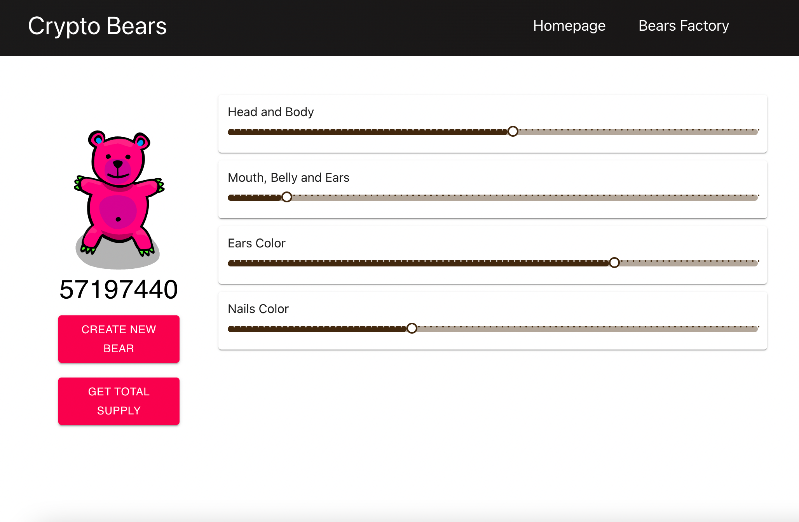
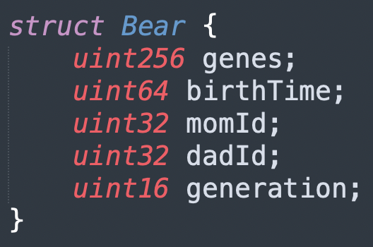
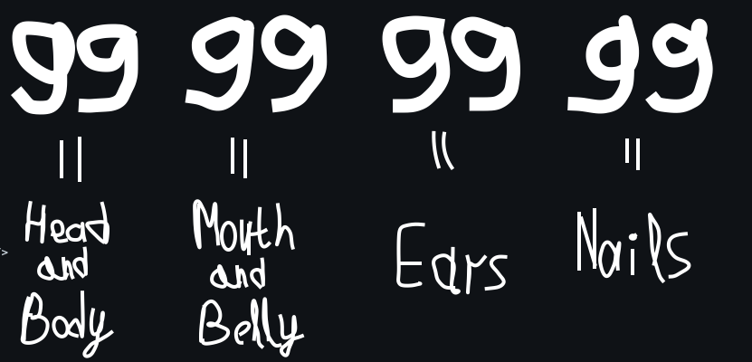

# Crypto Bears


[](https://github.com/romanrakhlin/CryptoBears/blob/master/LICENSE)

The clone of Crypto Kitties fully build on ReactJS and Solidity.



## About the project

Recently I started learning Crypto and Blockchain Development. And about a year ago I learned ReactJS but never actually used it in any project. So I decided to combine those two knowledges to create a relatively massive project. The idea of the project gave me <a href="https://academy.moralis.io">Moralis Academy</a> thus I learning crypto in their academy. They have a course called "Build an NFT Marketplace". In this course they are using just simple HTML, CSS and JS, not ReactJS, as I want. So from course I only studied part about Smart Contracts. Everything else, including website on ReactJS and connection it to Smart Contracts I've done completely by myself.

### Technologies and Tools
- JavaScript and Solidity
- ReactJS
- Truffle and Ganache
- MetaMask

## TODO
Front-end:
- [ ] Homepage (Marketplace)
- [X] Bears Factory (Creation of Bears)
- [ ] Profile (all NFT's that user owns)
- [ ] Breed (Page for breeding cats)

Smart Contracts:
- [X] Main Crypto Bears Contract
- [ ] Marketplace Contract
- [ ] Devide Main Contract into small one's

## About Crypto Bears

Each bear has those properies:
<p align="left">
  
</p>

The genes is a number that consists of 8 digits:
<p align="left">
  
</p>

Newly created bears are generation 0. Further bears are breeded from two differet bears and there are a formula for calculation the generation.

## Setup fro Testing

1) Compile the contracts and check if they are compilin succsesfully!
Then migrate contracts
```
truffle compile
truffle migrate
```
2) Donwload <a href="https://trufflesuite.com/ganache/">Ganache</a> app. And open it!! That all. Your local EVM begin to work.

3) Setting up a wallet for testing
- Download MetaMask extension to your browser and import existing wallet or create new.
- Make sure Ganache app up and running. Open transactions tap, all transactions will be seen there when we will be interacting with contracts.
- Next step is to open Metamask extension and tap on networks on top, then add new network, write name - Ganache Local, the you can get RPC-URl when open Ganache and on top you will see RPC Server, copy that url and paste it. Then the Chain Id is 1337.
- For testing an app we need some Ethereum. Open Ganache, choose one of ten accounts with some Ethereum on them, click the key image on the right and copy the private key. Then go to MetaMask, click on your icon in the top right corner, tap import account, paste your private key and press add.

Finally, you are able to test your app with MetaMask wallet !!

4) Run the Web App
```
npm install
npm start
```
